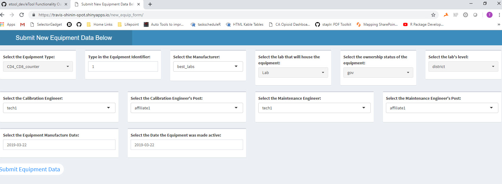

<style>
    a[href^="http"]:not([class="uri"])::after {
  content: "";
}
</style>

```{r include=F}
knitr::opts_chunk$set(warning = F,
                      echo = F,
                      message = F)

library(ggplot2)
library(reader)
library(ggthemes)
library(knitr)
library(rmarkdown)
library(dplyr)
library(tidyr)
library(lubridate)
library(stringi)
library(stringr)
library(shiny)
library(shinyWidgets)
library(forcats)
library(readr)
library(readxl)
library(tibble)
library(kableExtra)
library(gt)
```

# Introduction

Lab equipment is critical to supporting HIV-related activities in PEPFAR-supported countries. In order to provide quality laboratory services it is important to know what equipment is present in supported laboratories, if it is functional, and when maintenance activities were performed.

This report outlines when and how to use the 'New Equip Form' application. 

This application should **not** be used to enter equipment already described in the **[eTool](https://travis-shinin-spot.shinyapps.io/etool_dev/)**. This application should only be used to enter data describing equipment newly introduced to supported labs. Equipment data submitted using this form will automatically be added to the data source used by the eTool.

If you are entering data for lab equipment that will be housed at a lab **not** currently described in the eTool, contact your administrator so they can add the new facility to this application. 

# User Interface and Visual Layout

This application was designed to be a very simple form allowing the viewer to easily add equipment data to the existing database behind the eTool. The options included were deemed necessary for inclusion in the eTool by a member organizations under the Pan African Consortium (PAC). This application splits the options available for users into three main categories (see below);

Application Layout

1. Equipment Information
2. Engineer/Technician Information
3. Important Dates



Again, this form is meant to be logically laid out and is purely functional. Click **[here](https://travis-shinin-spot.shinyapps.io/new_equip_form/)** to go to the application.

The top row is comprised of information drop downs that describe the equipment and equipment location. The Equipment Type, Lab, Ownership, and Lab level drop downs are each composed of a fixed set of options to choose from. Select the option that best describes that individual piece of equipment. The equipment Identifier number can be typed in, if you hover over the white box you will see up and down arrows appear which can be used to increase or decrease this value by 1. If you click on the dropdown in the Manufacturer dropdown you will see that your pointer will turn into a cursor, this means that you can type a new value not already available list of dropdown items. We recognize there are many manufacturers and the available options may not be sufficient. 

The middle row is comprised drop downs describing the equipment engineer/technician responsible for the equipment. Similarly to the Manufacturer dropdown menu, each dropdown on the second row allows the user to type in a new value if the existing menu is not sufficient. **Do not** submit 'unknown' or similar values for these drop downs. It is important to designate a maintenance company (Post) as well as engineer/technician (name). 

The bottom row contains date fields describing when the equipment was manufactured as well as made active in the lab housing it. Click on the date shown in the drop down and navigate the popup calendar to choose a date. 

# Assumptions

In addition to the data you have enter using this application, several calculations will be done by the application based on your selections that will then be passed to the eTool data source. 

It is assumed that;

* The equipment will no longer be viable in 730 days (2 years)
* The equipment will need to be calibrated in 90 days
* The equipment will require maintenance in 180 days
* The equipment should be retired in 720 days (just under 2 years)

Additionally, the GPS locations for the lab are assumed based on the Laboratory chosen. Again, if you are entering data fora laboratory *not* listed be sure to contact your administrator to add it to the list.

# Data Update

This application was designed to add new equipment to the database underlying the eTool. If you are just altering equipment data rather than adding new equipment, use the eTool instead of this application. 

# Conclusions

This application can be used to add data for new equipment to the eTool database. Additional aesthetic changes can be made if desired. 


