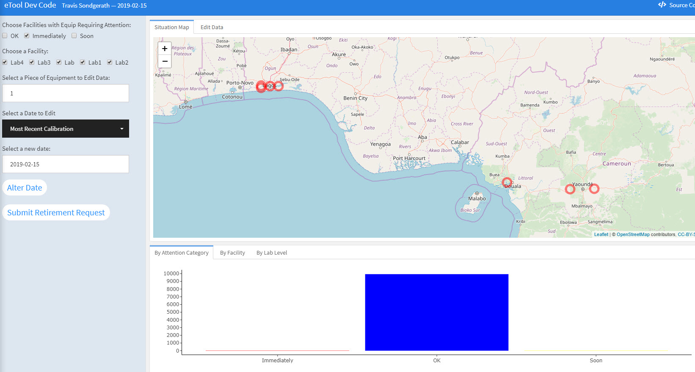

```{r include=F}
knitr::opts_chunk$set(warning = F,
                      echo = F,
                      message = F)

library(ggplot2)
library(reader)
library(ggthemes)
library(knitr)
library(rmarkdown)
library(dplyr)
library(tidyr)
library(lubridate)
library(stringi)
library(stringr)
library(shiny)
library(shinyWidgets)
library(forcats)
library(readr)
library(readxl)
library(tibble)
library(kableExtra)
library(gt)
```

# Introduction

The purpose of the eTool is primarily to help maintenance personnel, lab supervisors, and other interested stakeholders use the tool in the following ways;

* Identify labs that have equipment in need of attention
* Identify specific pieces of equipment in need of attention
* Differentiate between actions that need to be taken immediately and those that need to be taken soon
* Update the status of individual equipment and their underlying data
* Track when maintenance activities were performed. 

Lab equipment is critical to supporting HIV-related activities in PEPFAR-supported countries. In order to provide quality laboratory services it is important to know what equipment is present in supported laboratories, if it is functional, and when maintenance activities were performed. 

This effort was taken in part to identify what features would be necessary to develop an eTool with the functionality described above and also to describe what data would be necessary to create such a tool. In conjunction with the partner organizations involved in the pan-African Consortium, we developed a list of desired features for the eTool. Additionally, we outlined what equipment data would be necessary for the tool to function as desired.

Existing data held by partner organizations was found to be lacking many key elements. See the [full report](https://github.com/paceafenet/etool_dev/blob/master/existing_lab_data_exploration.md). Additionally, equipment data held by the maintenance partner was also found to be lacking. Resources required to collect necessary data would have caused substantial delay beyond the contracted project period. Therefore, the eTool outlined in this report was developed using dummy data and is for demonstration purposes only. However, it is not unreasonable to believe that such data could be procured given enough time and human resources using data collection tools already available to partner organizations. 

# User Interface and Visual Layout



The current eTool layout is meant to be informative and functional. Click [here](https://travis-shinin-spot.shinyapps.io/etool_dev/) for the current version of the eTool. 

Displayed prominently in the center of the tool by default is a map zoomed to the extent of all selected laboratories (all labs with equipment requiring immediate attention by default). A red circle indicates that the facility highlighted has **at least one** piece of equipment that requires immediate attention (maintenance or calibration past due or equipment no longer viable). Circles highlighted in yellow if attention required within 10 days (could set to any time period). The user can click or hover over any circle within the map to see which lab is highlighted.

In addition to the map, a second tab is included in the same window as the map which is currently named "edit data." This table shows equipment-specific data including the facility name, equipment ID, as well as critical dates for service dates and assumed next service dates depending on current service dates. The background color in each cell corresponds to the same color scheme as described above for the laboratories. 

The map and table are each responsive to the first two check box groups shown on the left. By default, the eTool displays data in the map and table only for equipment that requires immediate attention. It is also possible to filter to equipment requiring attention within 10 days or to those not requiring attention (labeled as 'OK'). 

At the bottom of the eTool there are three tabs; 'By Attention Category,' 'By Facility,' and 'By Lab Level.' Each of these are bar graphs. By Attention Category describes the number of pieces of equipment within each attention category, bar colors correspond to the color schemes outlined above. By Facility describes the number of equipment requiring immediate attention by facility (Lab, Lab1, Lab2, Lab3, Lab4 used for demonstration purposes), and Lab Level describes the number equipment requiring immediate attention by facility. District, regional, national, other used as lab levels as reasonable assumptions of levels that would be present in real data. Additionally, there is a scroll bar on the far right of each bar graph. Scrolling down reveals a table summarizing the data in the graphs. These three graphs are **not** responsive to the check box filters on the left side in the current version of the eTool. 

# Data Update

On the left side of the tool there is also one text box, one drop down selector, one date input, and two buttons. Based on the results shown in the map and table, the user could decide to take action and update the status of equipment described. The eTool was designed to address two scenarios;

1. Calibration dates do not reflect present status
  * Refer to 'Edit Table,' find the equipment ID for the equipment that needs to be edited
  * Select either 'Most Recent Calibration' or 'Most Recent Maintenance' from the 'Select a Date' dropdown
  * Select a date in 'Select a new date'
  * Click the 'Alter Date' button. A message will appear notifying you a change has been made to the data. If you have clicked this button in error or need to enter a different date, change your selections and click the button again.

2. Equipment has been taken out of service
  * The tool may reflect that equipment requires maintenance, however, it may be that the equipment has already been or will soon be retired.
  * Refer to 'Edit Table,' find the equipment ID for the equipment that needs to be edited, enter the ID in the text box
  * Click the 'Submit Retirement Request' button
  * if this button was selected in error the administrator will need to be contacted to alter the underlying data
  
In order to view the results of **either** of the changes described above in the eTool you will need to close the browser window the eTool is being viewed in and re-open the eTool.

# End Uses

A limited amount of data is shown in the eTool. The goal of the eTool is to provide a high level summary of the data in its current state as well as the ability to identify equipment requiring attention and alter their data where appropriate.

In addition to the functionality described above, the eTool was designed to preserve *all* equipment data. Thus each time a user alters the underlying data, the 'new' equipment data is added to the previous data. Thus if five changes were made to the same piece of equipment using the eTool, then there would be five rows of data for that equipment in the underlying dataset (only the most recent would be reflected in the eTool). 

This would allow for the creation of a 'life book' for individual pieces of equipment. By preserving all data for each piece of equipment it would be clear when and how often equipment were interacted with. Additionally, it would be clear when equipment was put in service, when it was taken out of service, and when it was maintained or calibrated. 

In addition to maintenance dates, the underlying data describes each piece of equipment in detail including the laboratory name, level, location, maintenance contractor, equipment type, etc. This information was excluded from the eTool as it fell outside of the desired scope of the eTool functionality. However, this additional information, when coupled with the fact that historical data is preserved when equipment data is updated using the eTool means there is a great deal of information that can be used in analyses outside the eTool. 

The table below shows the equipment features desired by the Equipment Maintenance Team. These features are contained in the demonstration data used to develop the current version of the eTool. 

```{r}
tt <- read_csv(file = "data\\fake_equip_data.csv") %>% 
  colnames() %>% 
  as_tibble() %>% 
  rename(`Column Names: Fake Data` = "value") %>% 
  gt() %>% 
  tab_header(title = "Table 1")

tt

```

# Conclusions

All functionality desired by the Equipment Maintenance Team is present in the current version of the eTool. However, minor aesthetic changes may be desirable before finalizing. The eTool is designed to be interactive. Users can alter the underlying data behind the eTool, additionally, all historical equipment data is preserved allowing for multiple uses of the data outside of the eTool's core functionality. 


