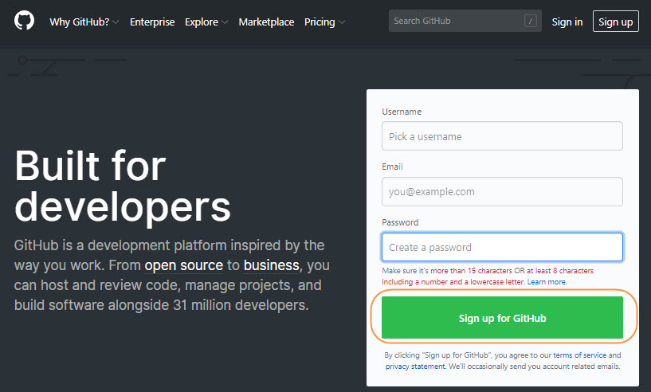

```{r setup, include=FALSE}
knitr::opts_chunk$set(echo = T,
                      warning = F,
                      message = F)

library(dplyr)
library(shiny)
library(shinyWidgets)
library(sparkline)  # Make sure I need this package
library(DT)
library(tibble)
library(lubridate)
library(rmarkdown)
library(leaflet)
library(tidyr)
library(ggplot2)
library(stringr)

```

# Introduction

This contract was entered into in order to assist PEPFAR-supported countries to further advance and sustain access to quality-assured HIV laboratory services and bridge the gaps towards the 90-90-90 targets. 

Specifically, this report will describe how to use and adapt the code which developed the application henceforth referred to as the 'eTool.'

# Project Setup

First, download or 'clone' the eTool project repository from [GitHub](https://github.com/about). If you do not already have a GitHub account, you can create one [here](https://github.com/) (see below). 



The eTool GitHub repository is private. As such it can only be viewed by those who have been added to the repository 'collaborator' list. If you do not have access, contact the project administrator. Once you have access to the repository, clone the repository (see below). 


Cloning a repository is essentially copying a group of files and and sub directories. Navigate to the cloned directory wherever you saved it. Inside this directory, double click the etool_dev.Rproj file if you have already installed R and RStudio. If you have not downloaded these tools, start **[here](https://support.rstudio.com/hc/en-us/articles/201141096-Getting-Started-with-R)**. There are links to downloading both R and RStudio as well as helpful resources for getting started in R programming. This report is *not* meant to be a complete guide to R programming. However, annotated R code is included along with instructions on running the code. 

The eTool code was developed to use Google sheets as the back end data source for the eTool. Although other back ends such as SQL Server or even free options such as SQLite would have allowed the eTool to function more quickly, I chose Google sheets as setting up an account is free and Google sheets are laid out in a format familiar to non-technical users. Additionally, Google makes a rich API available for Google sheets that makes obtaining and manipulating data stored in Google sheets simple. Lastly, the R package **[googlesheets](https://github.com/jennybc/googlesheets)** makes taking advantage of this API in R possible.

I have setup a Google account for the purposes of this project. There is already an existing Google sheet with the data used in the example eTool formatted exactly as it would need to be to run correctly. You can either create another sheet in the existing account or create your own. 

The log in information for the project Google account is included below;

* username: paceafenet
* password: projectpi2018

If you choose to create your own account you will need to generate an authentication token using the code below. See the annotations in the code for explanation and guidance. The file in the project repository named shiny_app_token.rds allows for Google authentication to the existing project Google account. Follow the code provided below to create an authentication token for a different account. 

```{r eval=FALSE}

library(googlesheets)  # This library interacts with Google sheets

# Prepare the OAuth token and set up the target sheet:
  # You only have to do this ONCE - after the first time, you only have to load the rds file
# into a new session

shiny_token <- gs_auth() # authenticate w/ your desired Google identity in the window 
# that appears after running this line

saveRDS(object = shiny_token,  # Aftern authenticating in the popup window, create an object
        # from the result
        file = "shiny_app_token.rds")  # Save as an RDS - could name this file as anything,
# it must however end with .rds

```

# Adapting the eTool Code

Again, this is not meant to be an exhaustive tutorial on R programming. However, below I provide annotation in several areas of the eTool code where adjustments may be made.

See lines 31 though 41 in etool_ev_code.Rmd below:

```{r eval=FALSE}
# curr_date <- mdy("5/1/2016")  # This line was purely for testing and can be deleted

googlesheets::gs_auth(token = "shiny_app_token.rds")  # This function will pass the 
# login information contained in this rds to Google and grant you access to this Google 
# sheet

my_sheets <- googlesheets::gs_ls()  # This creates a dataset containing information on 
# the sheets at the account specified above. If you created a new sheet different than the 
# project account, then you will see more than one row in the in the resulting dataset. 
# If you created a new account then you may only see one row

sheet_key <- my_sheets$sheet_key[1]  # Here I have created an object called sheet_key 
# defined by the first row in the sheet key colum. This value is stored as a 
# string - repeated below

ss <- googlesheets::gs_key(my_sheets$sheet_key[1])  # using the Google sheet key I make 
# a call to the Google sheets API that returns a list object containing the data from 
# my Google sheet as well as metadata about the Google sheets account.

start_data <- googlesheets::gs_read_csv(ss) %>%  # Lastly I take the list object 
  # created above and turn it into a dataframe using this function - this will be 
  # the original dataset used throughout the applications
  arrange(serial_num, desc(last_altered)) %>%
  distinct(serial_num, .keep_all = T)
```

# Using Updated Data Altered Using the eTool

The eTool is designed primarily to alter equipment data. Although there is some information about the equipment data shown, it is meant to describe the current state of the data only. Although the eTool displays the current state of the equipment data, the original and historical equipment data will be maintained in the Google sheet. Thus that data can be analyzed separately. In order to obtain all the data from the associated Google sheet use the code below. 

```{r eval=FALSE}

# The code below was also included in the eTool code. The object equip_data is a 
# dataframe comrpised of the code at the Google sheets acoount specified in 
# the shiny_app_toke.rds file. 

googlesheets::gs_auth(token = "shiny_app_token.rds")  

my_sheets <- googlesheets::gs_ls()  

sheet_key <- my_sheets$sheet_key[1]  

ss <- googlesheets::gs_key(my_sheets$sheet_key[1])

equip_data <- googlesheets::gs_read_csv(ss)
```

# Appendix

Below I highlight the names of several documents contained in this repository that may be helpful. 

1. etool_functionality_outline.Rmd
* This code outlines the purpose, layout, and functionality of the eTool. This code produces the PDF document found **[here](https://github.com/paceafenet/etool_dev/blob/master/eTool%20Functionality%20Outline.pdf)**.

2. fake_equip_data_gen.Rmd
* This code produces the fake dataset used as the data source for the eTool. Because available in-country data was found to be lacking, I created a dataset with realistic data that could be procured to populate future versions of the eTool.


